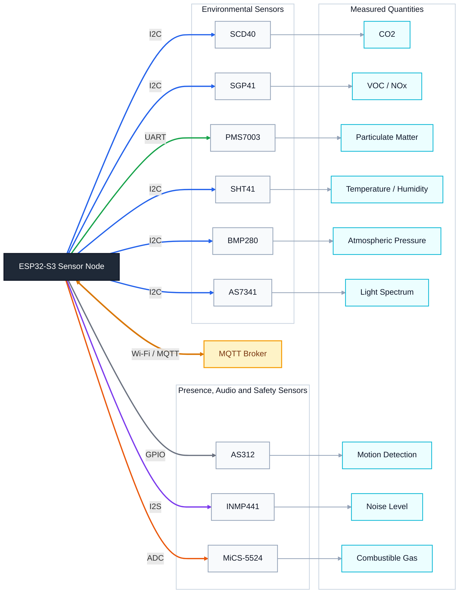

# Electrical Outlet IoT

An embedded environmental monitoring platform designed to fit inside a **standard electrical outlet enclosure**.

The device focuses on **indoor air quality and comfort monitoring**, rather than electrical power measurement.  
The objective is to integrate multiple environmental sensors into a compact embedded system capable of collecting meaningful indoor data.

---

# Project Objectives

- Monitor key **indoor air quality parameters**
- Track **comfort indicators** in living environments
- Maintain a **modular hardware architecture**
- Provide a foundation for **future data logging and automation**

---

# Planned Measurements

The system aims to monitor the following environmental indicators:

- CO₂ concentration
- Temperature
- Relative humidity
- Atmospheric pressure
- TVOC concentration
- Carbon monoxide and flammable gases
- Particulate matter (PM2.5 / PM10)
- Ambient noise level
- Light spectrum
- Motion detection

---

# Hardware Platform

The prototype is built around an **ESP32-S3 microcontroller**, combined with several specialized environmental sensors.

## Core Controller

- `ESP32-S3` — main microcontroller and communication interface

## Sensor Stack

| Measurement            | Sensor |
|------------------------|------|
| CO₂                    | **Sensirion SCD40** |
| VOC / NOx              | **Sensirion SGP41** |
| PM particles           | **Plantower PMS7003** |
| Temperature / Humidity | **Sensirion SHT41** |
| Atmospheric pressure   | **Bosch BMP280** |
| Light spectrum         | **AMS AS7341** |
| Motion detection       | **AS312 PIR sensor** |
| Noise level            | **INMP441 MEMS microphone** |
| Combustible gases      | **MiCS-5524 gas sensor** |

### Audio Acquisition Options

Two possible microphone configurations are considered:

- `ICS-40730 + PCM1809` (high quality analog path)
- `INMP441` digital MEMS microphone (current prototype)

---

### First layout of the prototype
this is a simple diagram that shows the layout of the prototype

# System Architecture

The system is structured around a sensor node based on an ESP32-S3 microcontroller.

All environmental sensors are connected directly to the microcontroller through I2C, UART, GPIO, ADC and I2S interfaces.

The firmware is implemented using **FreeRTOS**, where each sensor is managed by a dedicated acquisition task.  
Measurements are validated and aggregated before being transmitted through Wi-Fi using the **MQTT protocol**.

The MQTT broker acts as the central data hub for future integrations such as:

- home automation platforms
- data logging systems
- monitoring dashboards

# Development Status

The current stage of the project focuses on:

- sensor integration
- hardware validation
- initial firmware testing

The firmware architecture and data infrastructure will evolve as the hardware platform stabilizes.

# Project Progress Report

This section summarizes the current progress based on the repository contents.

## Completed

- System concept and sensor selection defined in the project documentation.
- Core firmware architecture implemented with FreeRTOS tasks and queues.
- SCD40 integration implemented (`scd40_task`) with data acquisition, validity checks, timeout supervision, and automatic recovery.
- RGB status LED task implemented with CO2 threshold mapping and offline indication.
- Watchdog configuration implemented and integrated into runtime tasks.
- First PCB work completed in KiCad with a main board project and multiple sensor-related schematic sheets.
- Initial bill of materials and component ordering tracked in `parts_shop/component.csv`.

## In Progress

- Full multi-sensor firmware integration beyond the currently active SCD40 path.
- Hardware bring-up and validation of all selected sensors on the prototype.
- End-to-end firmware robustness testing on real hardware.

## Open Points / Gaps -> fix these points before the first prototype

- `main.c` references `mq7_task` and related types, but no `mq7` implementation files are present yet in the repository.
- No automated test suite is currently implemented (the `test` folder still contains only the default template README).
- Data logging, communication pipeline, and automation features are not yet present.

## Next Milestones

- Implement and integrate the remaining sensor tasks one by one.
- Add a unified sensor data model and publish mechanism for all measurements.
- Add basic hardware-in-the-loop validation tests and fault-injection scenarios.
- Stabilize PCB revision after bring-up feedback and final pin mapping checks.

---
## Swiss T13 Outlet Plate Dimensions

- Front plate: ~86 mm x 86 mm
- Wall recess hole: ~55-60 mm diameter
- Box depth: ~45-60 mm

