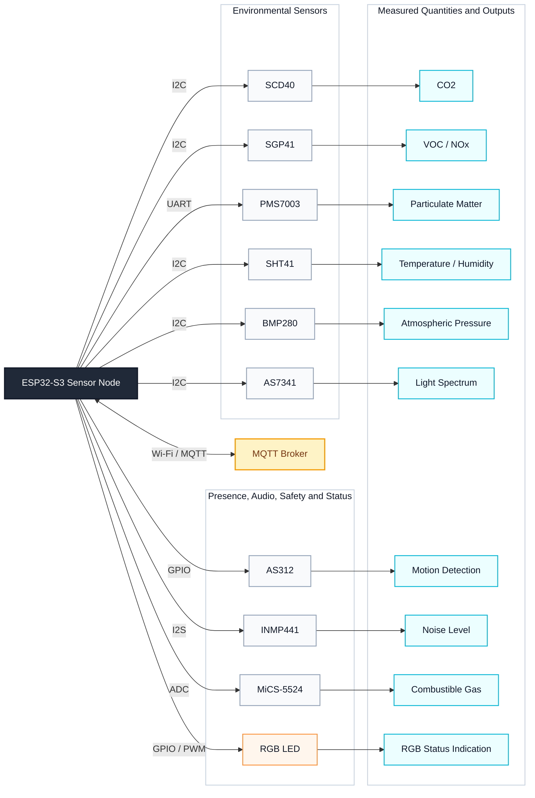
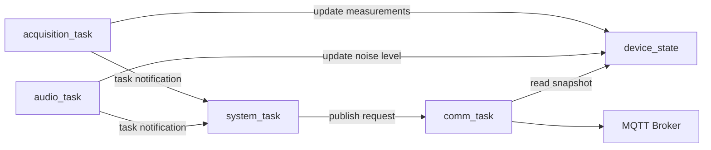

# Electrical Outlet IoT

An embedded environmental monitoring platform designed to fit inside a **standard electrical outlet enclosure**.

The device focuses on **indoor air quality and comfort monitoring**, rather than electrical power measurement.  
The objective is to integrate multiple environmental sensors into a compact embedded system capable of collecting meaningful indoor data.

---

# Project Objectives

- Monitor key **indoor air quality parameters**
- Track **comfort indicators** in living environments
- Maintain a **modular hardware architecture**
- Provide a foundation for **future data logging and automation**

---

# Planned Measurements

The system aims to monitor the following environmental indicators:

- CO₂ concentration
- Temperature
- Relative humidity
- Atmospheric pressure
- TVOC concentration
- Carbon monoxide and flammable gases
- Particulate matter (PM2.5 / PM10)
- Ambient noise level
- Light spectrum
- Motion detection
- Led status (rgb led)

---

# Hardware Platform

The prototype is built around an **ESP32-S3 microcontroller**, combined with several specialized environmental sensors.

## Core Controller

- `ESP32-S3` — main microcontroller and communication interface

## Sensor Stack

| Measurement                      | Sensor |
|----------------------------------|------|
| CO₂                              | **Sensirion SCD40** |
| VOC / NOx                        | **Sensirion SGP41** |
| PM particles                     | **Plantower PMS7003** |
| Temperature / Humidity           | **Sensirion SHT41** |
| Atmospheric pressure             | **Bosch BMP280** |
| Light spectrum                   | **AMS AS7341** |
| Motion detection                 | **AS312 PIR sensor** |
| Noise level                      | **INMP441 MEMS microphone** |
| Combustible gases                | **MiCS-5524 gas sensor** |
| - RGB LED status indicator       | **APHF1608SEEQBDZGKC** |

### Audio Acquisition Options

Two possible microphone configurations are considered:

- `ICS-40730 + PCM1809` (high quality analog path)
- `INMP441` digital MEMS microphone (current prototype)

---

### First layout of the prototype
this is a simple diagram that shows the layout of the prototype

# System Architecture

The system is structured around a sensor node based on an ESP32-S3 microcontroller.

All environmental sensors are connected directly to the microcontroller through I2C, UART, GPIO, ADC and I2S interfaces.

The firmware is implemented using **FreeRTOS**, where each sensor is managed by a dedicated acquisition task.  
Measurements are validated and aggregated before being transmitted through Wi-Fi using the **MQTT protocol**.

The MQTT broker acts as the central data hub for future integrations such as:

- home automation platforms
- data logging systems
- monitoring dashboards

# Development Status

The current stage of the project focuses on:

- sensor integration
- hardware validation
- initial firmware testing

The firmware architecture and data infrastructure will evolve as the hardware platform stabilizes.


# Project Progress Report

This section summarizes the current progress based on the repository contents.

---
## Swiss T13 Outlet Plate Dimensions

- Front plate: ~86 mm x 86 mm
- Wall recess hole: ~55-60 mm diameter
- Box depth: ~45-60 mm

# Firmware Architecture

The firmware is built on **FreeRTOS** and follows a **minimal task architecture** designed for reliability, maintainability, and predictable timing behavior. Instead of dedicating a separate task to each sensor, the system groups responsibilities into a small number of well-defined tasks. This approach reduces context switching, memory usage, and synchronization complexity, which is important for a production-grade embedded system.

The firmware is structured around **four main tasks**.

---

# Task Overview

| Task                | Responsibility                                                      |
|---------------------|---------------------------------------------------------------------|
| `acquisition_task`  | Polls environmental sensors and updates system state                |
| `audio_task`        | Handles I2S audio acquisition and noise level estimation            |
| `system_task`       | Supervises system health, alarms, watchdog and LED status           |
| `comm_task`         | Manages Wi‑Fi connectivity and MQTT communication                   |

This architecture provides clear separation between **sensor acquisition**, **signal processing**, **system supervision**, and **network communication**.

---

# System State Model

Sensor measurements and device status are stored in a centralized structure called `device_state`.

This structure represents the **current state of the device** and is shared between tasks. It acts as the single source of truth for the system.

Typical stored values include:

-   CO₂ concentration
-   VOC / NOx index
-   particulate matter
-   temperature and humidity
-   atmospheric pressure
-   light spectrum
-   motion detection
-   noise level
-   combustible gas level
-   network connectivity state
-   system fault flags

The acquisition tasks update this structure, while the communication task reads it to publish telemetry.

Access to `device_state` is protected using a **mutex** to guarantee thread‑safe access with minimal locking time.

---

# Inter‑Task Communication

The firmware uses a minimal set of synchronization primitives to keep the system deterministic and lightweight.

## Task Notifications

Direct **task notifications** are used for fast signaling between tasks.


For example, acquisition tasks can notify the `system_task` when:

-   a threshold is exceeded
-   a sensor failure occurs
-   a motion event is detected

Task notifications are preferred for one‑to‑one signaling because they are faster and require less RAM than queues.

---

## Publish Queue

`publish_queue`

A small queue is used to request outgoing telemetry or alarm publication.

Typical messages include:

-   periodic telemetry publication
-   alarm events
-   device status updates

The `comm_task` reads this queue and publishes messages over MQTT.

---

# Task Responsibilities

## Acquisition Task

`acquisition_task`

Responsible for managing the majority of environmental sensors.

Sensors handled by this task include:

-   SCD40 (CO₂)
-   SGP41 (VOC / NOx)
-   SHT41 (temperature / humidity)
-   BMP280 (pressure)
-   AS7341 (light spectrum)
-   PMS7003 (particulate matter)
-   AS312 (motion detection)
-   MiCS‑5524 (combustible gases)

Instead of running independent threads, sensors are polled using an **internal scheduler** based on time intervals.

Typical polling intervals:

  Sensor                   Interval
  ------------------------ ----------
  Motion detection         100 ms
  Gas sensor               1 s
  VOC / NOx                1 s
  Temperature / Humidity   2 s
  Pressure                 2 s
  Light spectrum           2--5 s
  CO₂                      5 s
  Particulate matter       5--10 s

The task updates the shared `device_state` structure and generates notifications when thresholds or faults occur.

---

## Audio Task (I2S)

`audio_task`

Handles audio acquisition from the **I2S MEMS microphone**.

Responsibilities include:

-   configuring the I2S peripheral
-   capturing audio samples using DMA
-   computing noise level metrics (RMS / dB)
-   updating the system noise measurement

This task is separated from the main acquisition loop because I2S audio streaming has different timing and buffering constraints.

Current prototype microphone:

INMP441 digital MEMS microphone

---

## System Supervision Task

`system_task`

Acts as the central control logic of the device.

Responsibilities include:

-   alarm detection
-   system fault monitoring
-   watchdog supervision
-   degraded mode handling
-   LED status control

The task reacts to notifications from acquisition tasks and decides whether telemetry or alarms must be published.

---

## Communication Task

`comm_task`

Responsible for all network communication.

Responsibilities include:

-   Wi‑Fi connection management
-   MQTT broker connection and reconnection
-   telemetry publishing
-   alarm message publishing
-   device status reporting

This task is the **single owner of the MQTT client**, avoiding concurrency issues.

When a publish request is received, the task reads the latest measurements from `device_state` and transmits them to the MQTT broker.

---

# Synchronization Mechanisms

The firmware relies on a minimal set of synchronization primitives.

## Mutex

`state_mutex`

Protects access to the shared `device_state` structure.

---

## Event Groups

Event groups are used to represent system state flags such as:

-   Wi‑Fi connected
-   MQTT connected
-   system ready
-   degraded mode
-   alarm active

These flags allow tasks to quickly react to changes in system status.

---

# Task Interaction Diagram



## Task Stack Sizes

| Task | Stack Size |
|-----|-----|
| acquisition_task | 4096 – 8192 words |
| audio_task | 8192 – 16384 words |
| system_task | 4096 words |
| comm_task | 8192 – 12288 words |

At the beginning of the project, relatively large stack sizes are used to avoid stack overflows.  
Later, the actual stack usage will be evaluated using:

`uxTaskGetStackHighWaterMark(NULL)`

Based on these measurements, the stack sizes can be reduced to optimize memory usage.

---

## Task Priorities

| Task | Priority |
|-----|-----|
| acquisition_task | 2 |
| audio_task | 2 |
| system_task | 4 |
| comm_task | 3 |

The default priorities for the **main task** and the **idle task** will remain unchanged.

## Logging in ESP-IDF

| Macro      | Meaning  | When to use                    |
|------------|----------|-------------------------------|
| ESP_LOGE   | Error    | Errors or problems            |
| ESP_LOGW   | Warning  | Warnings or recoverable issues|
| ESP_LOGI   | Info     | Normal informational output   |
| ESP_LOGD   | Debug    | Debugging information         |
| ESP_LOGV   | Verbose  | Highly detailed trace output  |

## Stack tuning
I implemented a function to periodically log the stack usage of the current task.
```c
void logTaskStackUsage(uint32_t *counter, const char *TAG, UBaseType_t task_stack_size)
{
    if (++(*counter) % 10 == 0)
    {
        UBaseType_t stack_remaining = uxTaskGetStackHighWaterMark(NULL);
        UBaseType_t stack_used = task_stack_size - stack_remaining;

        ESP_LOGI(TAG, "Stack used: %u words | remaining: %u words",
                 stack_used, stack_remaining);
    }
}
```
The `counter` parameter is used to control how often the stack usage is printed. `uxTaskGetStackHighWaterMark()` returns the minimum amount of stack that has remained unused since the task started running. This allows estimating the real stack usage of the task.

## Task Creation
The basic task structure and stack monitoring have been implemented.  
The next step is to develop the internal logic of each task.

## Device State

The **device state** represents the current internal state of the device. It contains the latest measurements collected from the sensors as well as important system status flags.

All tasks in the firmware share this structure. Instead of storing measurements in multiple global variables, all data is centralized inside a single structure called `device_state_t`. This approach improves code readability, simplifies data management, and provides a single source of truth for the system.

The device state is implemented in the `device_state.h` and `device_state.c` files.

```c
//Number of spectral channels measured by the AS7341
#define AS7341_CHANNELS 8

//AS7341 spectral data structure
typedef struct{
    float channels[AS7341_CHANNELS];
} as7341_data_t;

typedef struct{
    float co2_ppm;
    float temperature_c;
    float humidity_percent;
    float pressure_hpa;

    float voc_index;
    float nox_index;

    float pm1_0_ug_m3;
    float pm2_5_ug_m3;
    float pm10_ug_m3;

    float noise_db;

    as7341_data_t light;

    float gas_level_raw;

    bool motion_detected;

    bool wifi_connected;
    bool mqtt_connected;
    bool alarm_active;
    bool degraded_mode;

} device_state_t;

extern device_state_t g_device_state;
extern SemaphoreHandle_t g_device_state_mutex;
void device_state_init(void);
```

### Global Device State

A global instance of the structure is created:

> `g_device_state`

This variable contains the latest known values of all measurements and system flags. All tasks read from or update this structure when interacting with the system state.

### Thread Safety

Since multiple FreeRTOS tasks access the device state concurrently, access must be protected using a mutex.

> `g_device_state_mutex`

The mutex ensures that only one task at a time can read or modify the structure, preventing race conditions and inconsistent data.

Typical usage pattern:
```shell
take mutex
read or update state
release mutex
```

### Initialization

The function `device_state_init()` is responsible for initializing the module:

- sets the initial state values

- creates the mutex used for synchronization

This function must be called during system startup before any task accesses the device state.

### Usage

The device state is initialized in `main.c`. After initialization, the code verifies that the mutex was successfully created.

All tasks that need to read or update the device state must access it through the mutex in order to guarantee thread-safe access.

Typical usage pattern:

```c
if (xSemaphoreTake(g_device_state_mutex, portMAX_DELAY) == pdTRUE)
{
    g_device_state.temperature_c = 22.5f;
    g_device_state.humidity_percent = 45.0f;

    xSemaphoreGive(g_device_state_mutex);
}

example:

```c
static const char *TAG = "ACQUISITION";

void acquisition_task(void *pvParameters)
{
    (void)pvParameters;
    uint32_t counter = 0;
    TickType_t xLastWakeTime = xTaskGetTickCount();

    for (;;)
    {
        // Example sensor values (placeholder for real sensors)
        float temp = 22.5f;
        float hum  = 45.0f;

        // Update the shared device state
        if (xSemaphoreTake(g_device_state_mutex, portMAX_DELAY) == pdTRUE)
        {
            g_device_state.temperature_c = temp;
            g_device_state.humidity_percent = hum;

            xSemaphoreGive(g_device_state_mutex);
        }
        vTaskDelayUntil(&xLastWakeTime, pdMS_TO_TICKS(1000));
    }
}
```