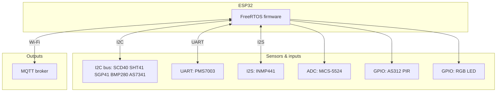
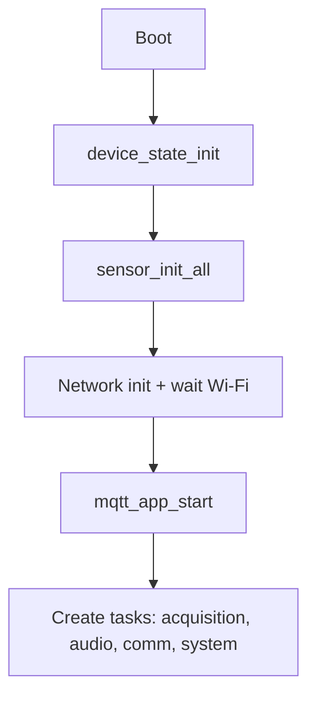
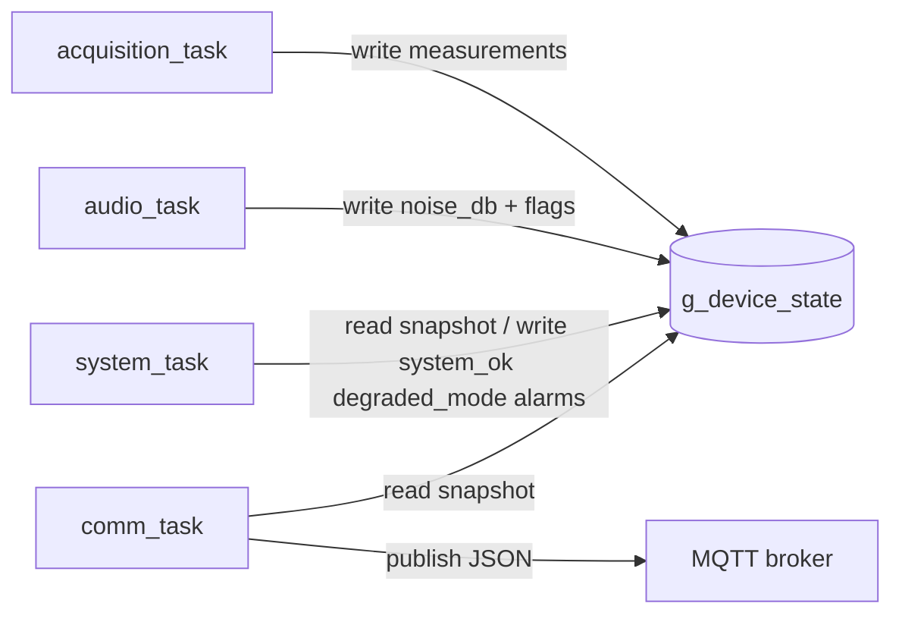

# Electrical Outlet IoT — Environmental Sensor Node

**Embedded indoor air-quality and comfort monitor** designed to eventually fit a **standard wall-outlet form factor** (target: Swiss T13-style plate). The firmware runs on **Espressif ESP32** (ESP-IDF / FreeRTOS), aggregates many environmental sensors, estimates **ambient noise (dB SPL)** from a digital MEMS microphone, and publishes telemetry over **Wi-Fi / MQTT**.

<p align="center">
  
</p>

<p align="center"><em>Breadboard bring-up: ESP32 dev module, I2C sensor cluster, UART particulate sensor, I2S MEMS mic, ADC gas sensor, PIR, and RGB status LED.</em></p>

---

## At a glance

| Area | Details |
|------|---------|
| **MCU** | ESP32 (`esp32dev` / PlatformIO, ESP-IDF 5.x) |
| **RTOS** | FreeRTOS — four application tasks + driver stack |
| **Buses** | I2C (shared), UART (PMS7003), I2S Philips 24-bit mono (INMP441), ADC (MiCS-5524), GPIO (PIR, LED) |
| **Cloud edge** | Wi-Fi station, MQTT client (JSON telemetry) |
| **Repo layout** | `src/` application, `include/` app headers, `lib/` sensor drivers & services, `datasheet/` PDFs, `img/` photos |

---

## Quick start

```bash
pio run
pio run -t upload
pio device monitor -b 115200
```

Configure Wi-Fi and MQTT in `lib/config/include/app_config.h` (use secrets management appropriate for your deployment; do not commit real credentials to public forks).

---

## Measured quantities

| Quantity | Sensor | Interface |
|----------|--------|-----------|
| CO₂, T, RH (on-chip) | Sensirion **SCD40** | I2C |
| VOC / NOx index | Sensirion **SGP41** | I2C (compensated with SHT41 when available) |
| PM1 / PM2.5 / PM10 | Plantower **PMS7003** | UART |
| Temperature / humidity | Sensirion **SHT41** | I2C |
| Pressure / temperature | Bosch **BMP280** | I2C |
| Visible spectrum (8 channels) | AMS **AS7341** | I2C |
| Motion | **AS312** PIR | GPIO |
| Noise level (SPL estimate) | **INMP441** | I2S |
| Combustible gas (raw + estimated ppm) | **MiCS-5524** | ADC |
| Status | RGB LED | GPIO / PWM-capable pins |

An alternate **high-end analog mic path** (e.g. ICS-40730 + external ADC) was considered; the current prototype standardizes on **INMP441** for simplicity and digital integrity.

---

## Hardware platform

### Controller

- **ESP32** (dual-core, Wi-Fi) on a classic **ESP32 DevKit**-style board (`board = esp32dev` in PlatformIO).

### Prototype pin assignment (see `lib/config/include/esp32_pinout.h`)

| Function | GPIO |
|----------|------|
| I2C SDA / SCL | 21 / 22 |
| PMS7003 UART RX / TX (ESP view) | 17 / 16 |
| PMS7003 SET / RESET | 4 / 5 |
| PIR OUT | 27 |
| I2S WS / BCLK / DIN | 25 / 26 / 33 |
| MiCS-5524 ADC | 34 |
| RGB LED R / G / B | 13 / 12 / 14 |

### Enclosure target (Swiss T13–class plate)

- Front plate ≈ **86 × 86 mm**
- Wall recess ≈ **55–60 mm** diameter
- Box depth ≈ **45–60 mm**

---

## System overview



---

## Firmware architecture

The design favors **few cooperative tasks** instead of one task per sensor: lower context-switch cost, simpler locking, and predictable timing. Sensor polling uses **deadline-style timestamps** inside `acquisition_task`; the **audio path** stays isolated because I2S has different latency and buffer requirements than I2C/UART.

### Boot sequence (`app_main`)



### Tasks

| Task | Role | Stack (words) | Priority | Period |
|------|------|----------------|----------|--------|
| `acquisition_task` | Polls all environmental sensors; commits to `g_device_state` | 4096 | 2 | 100 ms loop |
| `audio_task` | I2S read, RMS / dB SPL, updates `noise_db` + audio flags | 4096 | 2 | 500 ms |
| `comm_task` | MQTT periodic publish, availability, alarms | 4096 | 3 | 5000 ms |
| `system_task` | Health / degraded mode / flags (motion supervised today) | 4096 | 4 | 2000 ms |

Stack high-water marks are logged periodically via `logTaskStackUsage()` in `src/task_config.c`.

### Task and data flow



---

## Shared state: `device_state_t`

All tasks coordinate through **`g_device_state`** protected by **`g_device_state_mutex`**. Acquisition (and audio) **do not hold the mutex while talking to hardware**; they refresh a **task-local** copy (`acquisition_local_state_t`) and perform a **short critical section** to copy into `g_device_state`.

Representative fields (see `lib/device_state/include/device_state.h` for the full structure):

```c
typedef struct {
    float co2_ppm;
    float temperature_scd40;
    float humidity_scd40;
    float temperature_c;
    float humidity_percent;
    float bmp280_pressure_hpa;
    float bmp280_temperature_c;
    float voc_index;
    float nox_index;
    float pm1_0_ug_m3, pm2_5_ug_m3, pm10_ug_m3;
    as7341_data_t light;   /* 8 spectral channels */
    float gas_level_raw;
    float gas_ppm;
    bool motion_detected;
    float noise_db;
    /* last_update ticks, per-sensor valid/fault, wifi/mqtt, system_ok, alarms, ... */
} device_state_t;
```

Commit pattern (conceptually):

```text
read sensors into local_state   // no mutex
take mutex
copy local_state → g_device_state
give mutex
```

---

## Acquisition scheduling

Per-sensor intervals are defined in `include/task_config.h`:

| Sensor / group | Interval |
|----------------|----------|
| AS312 (motion) | 100 ms |
| MiCS-5524 | 1000 ms |
| SGP41 | 1000 ms |
| SHT41 | 2000 ms |
| BMP280 | 2000 ms |
| AS7341 | 3000 ms |
| SCD40 | 2500 ms (polls around sensor cycle; handles `ESP_ERR_NOT_FINISHED`) |
| PMS7003 | 5000 ms (handles stabilization / incomplete frames) |

**Sensor init** (`lib/sensor_init/src/sensor_init.c`) brings up GPIO, ADC, UART, I2S, `i2cdev` for I2C, then each device driver. Non-fatal init failures are logged and skipped so bring-up can proceed with a subset of sensors.

---

## Audio: INMP441 and SPL estimate

- **I2S**: Philips stereo format, **24-bit**, **mono**, **16 kHz**; `mclk_multiple` set for ESP-IDF 24-bit rules (`I2S_MCLK_MULTIPLE_384`).
- **Critical detail**: DMA provides **32-bit words** with the **24-bit sample left-aligned**. Correct scaling uses an **arithmetic right shift by 8**, not masking the low 24 bits (see [ESP-IDF discussion #15721](https://github.com/espressif/esp-idf/issues/15721)).

```c
/* After i2s_channel_read into int32_t samples: */
static int32_t sample_s24_from_i2s_word(int32_t raw)
{
    return raw >> 8;
}
```

- **SPL**: RMS is computed **after removing DC** (mean subtraction). Level is mapped using the **INMP441 datasheet** reference (1 kHz, 94 dB SPL → digital peak code), then a **calibratable offset** `INMP441_SPL_OFFSET_DB` in `lib/inmp441/src/inmp441_w.c` to align with an external **A-weighted** meter. Expect small residual errors versus a Class 1 meter due to weighting, mounting, and self-noise.

---

## System supervision (`system_task`)

Today, supervision focuses on the **motion channel**: invalid data, driver fault, or **stale updates** (`MOTION_TIMEOUT_MS`, 15 s in `include/system_task.h`) force **degraded** mode. **Absence of motion is not a fault** — only sensor health matters. Alarm lines exist (`motion_alarm`, `gas_alarm`, `alarm_active`) for extension; current policy keeps alarms inactive while scaffolding is validated.

---

## MQTT and `comm_task`

- **Single owner** of the MQTT client (started in `mqtt_app_start()` before tasks run).
- `comm_task` snapshots `g_device_state`, calls **`mqtt_publish_all_periodic()`** and related helpers under `lib/mqtt/`.
- Typical topic layout (device id from `APP_DEVICE_ID`):

```text
devices/<device_id>/state
devices/<device_id>/telemetry/environment
devices/<device_id>/telemetry/audio
devices/<device_id>/status/system
devices/<device_id>/event/alarm
devices/<device_id>/availability
devices/<device_id>/command
```

Debug subscription (example on a LAN broker):

```bash
mosquitto_sub -h <broker_host> -t "#" -v
```

---

## Repository layout

```text
src/              Application entry (main.c), FreeRTOS tasks
include/          Task headers, board-independent app configuration hooks
lib/
  as312, as7341, bmp280, mics5524, pms7003, scd40, sgp41, sht41  Sensor drivers
  inmp441/        I2S microphone + SPL estimation
  sensor_init/    Central peripheral init (GPIO, ADC, UART, I2S, i2cdev)
  device_state/   Shared state + mutex
  mqtt/           Topics, JSON payloads, publish helpers
  network/        Wi-Fi connection manager
  config/         Pinout, app_config (Wi-Fi/MQTT — secure for production)
datasheet/        Vendor PDFs for listed sensors
img/              Project photos (prototype)
circuit_pcb/      KiCad-related assets (separate from firmware build)
```

---

## Datasheets (local copies)

PDFs under `datasheet/` include: **SHT4x**, **SCD4x**, **SGP41**, **BMP280**, **AS7341**, **PMS7003**, **INMP441**, **MiCS-5524**, **AS312 PIR**.

---

## Logging (ESP-IDF)

| Macro | Use |
|-------|-----|
| `ESP_LOGE` | Hard failures |
| `ESP_LOGW` | Recoverable / degraded |
| `ESP_LOGI` | Normal lifecycle |
| `ESP_LOGD` / `ESP_LOGV` | Verbose sensor traces |

Periodic **stack usage** logging:

```c
void logTaskStackUsage(uint32_t *counter, const char *TAG, UBaseType_t task_stack_size)
{
    if (++(*counter) % 10 == 0) {
        UBaseType_t stack_remaining = uxTaskGetStackHighWaterMark(NULL);
        UBaseType_t stack_used = task_stack_size - stack_remaining;
        ESP_LOGI(TAG, "Stack used: %u words | remaining: %u words",
                 stack_used, stack_remaining);
    }
}
```

---

## Roadmap

- Mechanical integration into **outlet-depth** enclosure and **production PCB** (see `circuit_pcb/`).
- Extend **system_task** supervision to all sensors (validity, fault, freshness) with consistent timeouts.
- Hardening: **secure credential storage**, **OTA**, and optional **Home Assistant** auto-discovery.

---

## License

Apache License 2.0 — see file headers in `src/` and `lib/`.

## Authors

Simone Pelascini, Aurélien Bollin (see copyright notices in source files).
