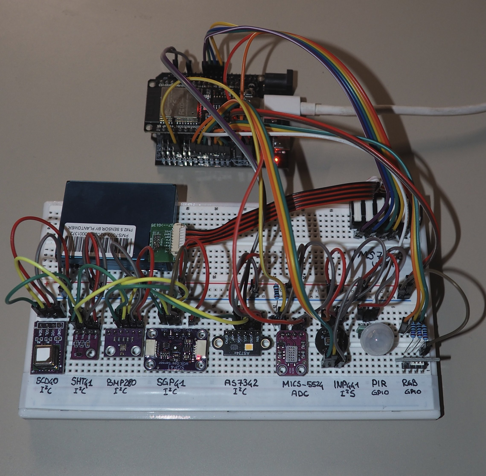
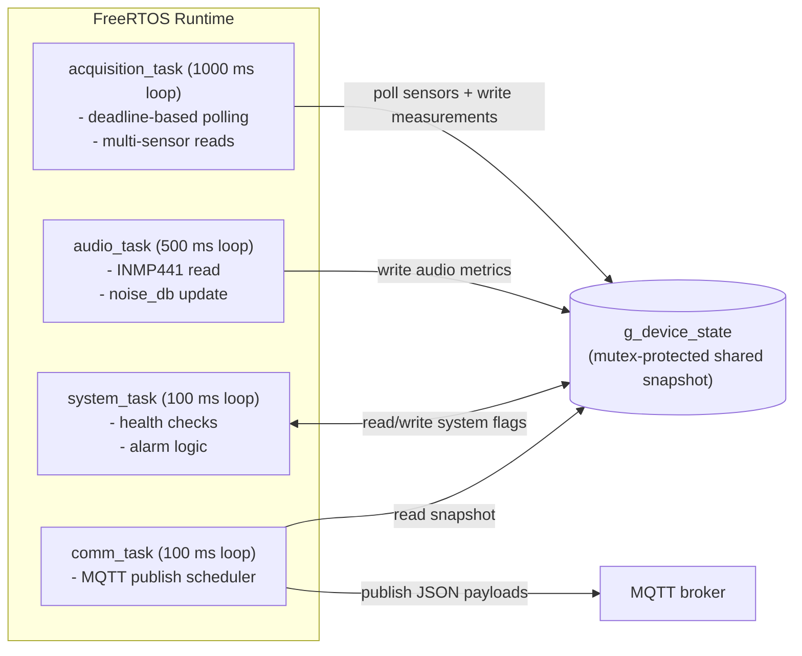

# Electrical Outlet IoT


ESP32-based environmental monitoring firmware plus a lightweight web dashboard for live MQTT telemetry.

The project is built around an ESP32 running ESP-IDF/FreeRTOS, collecting indoor environment data from multiple sensors (air quality, climate, particulate matter, light spectrum, motion, gas, and audio level), then publishing JSON payloads to MQTT. A Node.js dashboard subscribes to these topics and visualizes live values and trends.

<p align="center">
  
</p>

---

## Features

- Multi-sensor acquisition on I2C, UART, I2S, ADC, and GPIO.
- FreeRTOS architecture with dedicated acquisition, audio, system, and communication tasks.
- Shared mutex-protected runtime state (`g_device_state`) with validity/fault flags and timestamps.
- Wi-Fi station mode with automatic reconnect and MQTT telemetry publishing.
- System health evaluation and alarm logic (motion, gas threshold, CO2 level bands).
- Real-time web dashboard (Express + Socket.IO + Chart.js) driven by MQTT messages.

---

## Hardware and Sensors

### Controller
- ESP32 DevKit-style board (`platformio.ini`: `board = esp32dev`, framework `espidf`).

### Sensor set
- `SCD40`: CO2, temperature, humidity (I2C)
- `SHT41`: temperature, humidity (I2C)
- `SGP41`: VOC/NOx indices (I2C, optional compensation from SHT41)
- `BMP280`: pressure, temperature (I2C)
- `AS7341`: 8-channel visible spectrum (I2C)
- `PMS7003`: PM1.0 / PM2.5 / PM10 (UART)
- `MiCS-5524`: gas raw voltage + estimated ppm (ADC)
- `AS312`: PIR motion sensor (GPIO)
- `INMP441`: noise level estimate in dB SPL (I2S)
- RGB status LED (GPIO)

### Default pinout
Defined in `lib/config/include/esp32_pinout.h`:

- I2C SDA/SCL: GPIO `21` / `22`
- PMS7003 TX/RX (sensor side): GPIO `16` / `17`
- PMS7003 SET/RESET: GPIO `4` / `5`
- PIR output: GPIO `27`
- I2S WS/SCK/SD: GPIO `25` / `26` / `33`
- MiCS-5524 ADC: GPIO `34`
- RGB LED R/G/B: GPIO `13` / `12` / `14`

---

## Firmware Architecture

### Boot flow
`app_main()` in `src/main.c` performs:

1. `device_state_init()`
2. `sensor_init_all()`
3. `network_app_init()` and wait for Wi-Fi connection
4. `mqtt_app_start()`
5. Task creation: `acquisition_task`, `audio_task`, `comm_task`, `system_task`

If sensor/network init fails, startup aborts.

### FreeRTOS tasks
Task definitions are configured in `include/task_config.h`.

| Task | Main role | Priority | Stack (words) | Loop period |
|---|---|---:|---:|---:|
| `acquisition_task` | Poll environmental sensors and update shared state | 2 | 4096 | 1000 ms |
| `audio_task` | Read INMP441 and update noise metrics | 2 | 4096 | 500 ms |
| `comm_task` | Publish MQTT system/environment/alarm payloads | 3 | 4096 | 100 ms |
| `system_task` | Evaluate health and alarm state | 4 | 4096 | 100 ms |

The firmware uses periodic polling instead of interrupt-driven sampling for most sensors.
`acquisition_task` runs every 1000 ms and checks per-sensor deadlines (for example 1000 ms, 2000 ms, 2500 ms, 5000 ms depending on the sensor). When a deadline is reached, it reads that sensor, updates local values, then commits a synchronized snapshot to the shared device state.
In parallel, `audio_task` handles the INMP441 capture pipeline at its own cadence, while `system_task` computes health/alarm flags and `comm_task` publishes MQTT payloads from a consistent state snapshot.



### Shared runtime state
`lib/device_state/include/device_state.h` defines:

- `g_device_state` (`device_state_t`): all sensor values, validity/fault flags, timestamps, connectivity flags, alarm status.
- `g_device_state_mutex`: protects shared state access.
- `g_sensor_driver_mutex`: serializes sensor driver access and restore operations.

### Health and alarms
Implemented in:
- `lib/health/src/health.c`
- `lib/alarm/src/alarm.c`

Current logic includes:
- degraded mode/system status based on validity/fault/freshness checks,
- motion alarm from PIR,
- gas alarm when MiCS-5524 estimated ppm is above threshold,
- CO2 qualitative level (`optimal`, `good`, `moderate`, `poor`, `very poor`, `critical`).

---

## MQTT Interface

Topic builders are implemented in `lib/mqtt/src/mqtt_topic.c`.

Published topics:

- `devices/<device_id>/telemetry/environment`
- `devices/<device_id>/status/system`
- `devices/<device_id>/event/alarm`

Payload builders are in `lib/mqtt/src/mqtt_payload.c`:

- **Environment payload**: CO2, temperatures, humidities, pressure, VOC/NOx, PM values, light channels, gas values, noise dB.
- **System payload**: `system_ok`, `degraded_mode`, `wifi_connected`, `mqtt_connected`, `status`.
- **Alarm payload**: `as312_alarm`, `mics5524_alarm`, `co2_alarm_level`.

---

## Repository Structure

```text
.
├── src/                    # app_main and FreeRTOS task implementations
├── include/                # task headers and timing/priority configuration
├── lib/
│   ├── config/             # app config template and ESP32 pin mapping
│   ├── sensor_init/        # centralized peripheral/sensor initialization
│   ├── device_state/       # shared state and mutexes
│   ├── network/            # Wi-Fi connection management
│   ├── mqtt/               # topic/payload/publish/client logic
│   ├── health/             # system health checks
│   ├── alarm/              # alarm decision logic
│   ├── inmp441/            # audio wrapper and dB estimate
│   └── ...                 # individual sensor drivers
├── server/                 # Node.js + Socket.IO live dashboard
├── scripts/                # build helper scripts (clangd/toolchain patching)
├── datasheet/              # sensor datasheets
└── platformio.ini          # PlatformIO environment
```

---

## Getting Started

### 1) Firmware (ESP32)

### Prerequisites
- [PlatformIO Core](https://platformio.org/install)
- ESP32 board connected over USB

### Configuration
1. Create/update `lib/config/include/app_config.h` using `lib/config/include/app_config_template.h`.
2. Set:
   - `APP_WIFI_SSID`
   - `APP_WIFI_PASSWORD`
   - `APP_MQTT_BROKER_URI`
   - `APP_MQTT_USERNAME`
   - `APP_MQTT_PASSWORD`
   - `APP_DEVICE_ID`
3. If needed, adjust GPIO mapping in `lib/config/include/esp32_pinout.h`.
4. Update serial upload settings in `platformio.ini` (`upload_port`, optionally `upload_speed`).

### Build, flash, monitor
```bash
pio run
pio run -t upload
pio device monitor -b 115200
```

Other useful commands:
```bash
# clean build
pio run -t clean
# erase flash
pio run -t erase
# generate compiledb database for IDE indexing
pio run -t compiledb
```

### 2) Dashboard server

The dashboard is located in `server/` and subscribes to MQTT topics, then forwards updates to browser clients via Socket.IO.

### Prerequisites
- Node.js 18+ recommended

### Setup
```bash
cd server
npm install
cp .env.example .env
```

Edit `.env`:
- `MQTT_BROKER_URL`
- `MQTT_USERNAME`
- `MQTT_PASSWORD`
- `PORT` (default `3000`)
- `ALARM_ON_MS` (temporary alarm display duration)

### Run
```bash
npm start
```

Open: `http://localhost:3000`

---

## Development Notes

- Build options and monitor/upload defaults are in `platformio.ini`.
- `scripts/update_clangd_toolchain.py` updates `.clangd` include sections after build for better IDE indexing.
- Sensor polling and publish intervals are centralized in `include/task_config.h`.
- Debug logs use ESP-IDF logging macros (`ESP_LOGE/W/I/D`).

---

## Security Notes

- Do not commit real Wi-Fi/MQTT credentials.
- Keep secrets only in local config files (`app_config.h`, `server/.env`) and exclude them from public history.

---

## License

This project is licensed under the Apache License 2.0 (see source headers).

## Authors

- Simone Pelascini
- Aurélien Bollin
